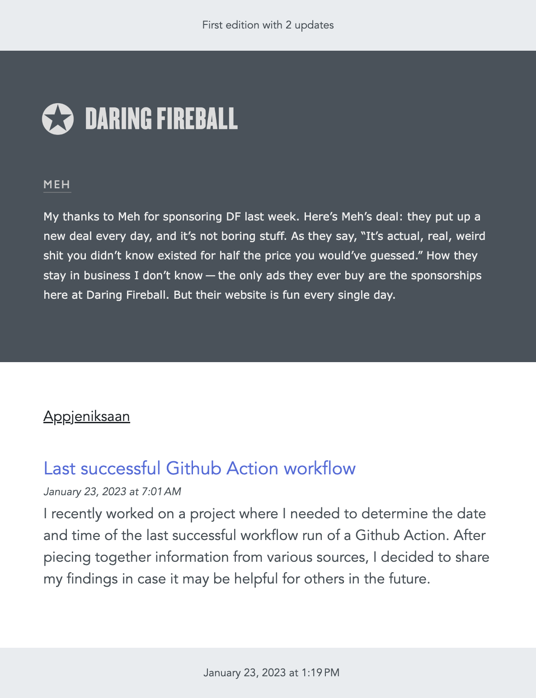

# RSS to Email

Keep up to date with your favorite RSS feeds at the time and interval you specify. Everything runs inside your own Github account.

This project combines the simplicity of creating custom emails with React and Typescript provided by the [react-email](https://github.com/resendlabs/react-email) project, with the ability to schedule updates based on a simple Github Actions workflow.

Updates are based on the success of the previous run, so you can harness the power of cron to send updates every week or every hour.

[Introductory post on my blog](https://appjeniksaan.nl)

## Getting started

1. [Fork](../../fork) this repository
2. Update [feeds.ts](src/feeds.ts) to your favorite RSS feed(s)
3. Update the [cron schedule](.github/workflows/send-email.yaml#L5) in the workflow file
4. Add the following [repository variables](../../settings/variables/actions) in settings:
   - `SMTP_SERVER` for example: smtp.fastmail.com
   - `SMTP_PORT` for example: 587
5. Add the following [repository secrets](../../settings/secrets/actions) in settings:
   - `MAIL_TO` the mail address to send the email to
   - `SMTP_PASSWORD`
   - `SMTP_USERNAME`
6. Done :muscle:

| :warning: | The above variables and secrets can also be changed directly in the [workflow](.github/workflows/send-email.yaml), but be aware that if your repo is public that this could expose your credentials. |
| :-------: | :--------------------------------------------------------------------------------------------------------------------------------------------------------------------------------------------------- |

## Local dev server

The project includes a local dev server to view and modify the email template based on your RSS feeds.

```bash
npm install
npm run dev
```

## Pro and cons

:fire: your data stays in your own Github account

:snowflake: fully customize the email

:date: receive the updates when and where you want

:poop: might have to do some tweaking

## Screenshot

Below is a screenshot of how the [Daring Fireball](https://daringfireball.net/) updates use custom styling and my own blog has the default style.


