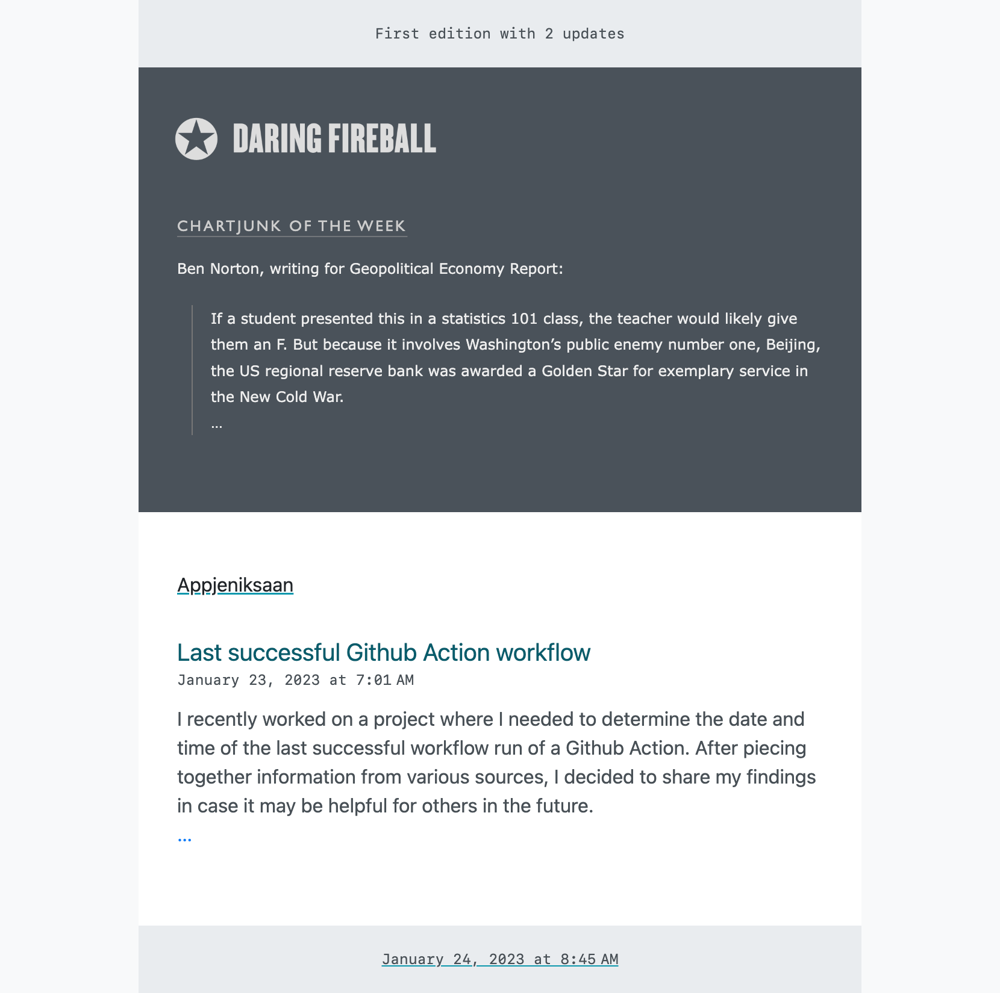

# RSS to Email

Introducing a new way to stay on top of your favorite RSS feeds - on your own terms.

This project allows you to set up custom email updates based on the RSS feeds you specify, all within the comfort of your own Github account. Utilizing the user-friendly interface of React and TypeScript through the [react-email](https://github.com/resendlabs/react-email) project, and the scheduling capabilities of Github Actions, you can have updates delivered at the time and frequency of your choosing. With updates based on the success of the previous run, you have the flexibility to schedule updates as frequently as every hour or as infrequently as every week.

Say goodbye to constantly checking for updates, and hello to staying informed on your own schedule.

Thank you ChatGPT for writing the above introduction :wink:

[Introductory post on my blog](https://appjeniksaan.nl)

## Getting started

1. [Fork](../../fork) this repository
2. Update [feeds.ts](src/feeds.ts) with your favorite RSS feed(s)
3. Update the [cron schedule](.github/workflows/send-email.yaml#L5) in the workflow file
4. Add the following [repository variables](../../settings/variables/actions) in settings:
   - `SMTP_SERVER` for example: smtp.gmail.com
   - `SMTP_PORT` for example: 587
5. Add the following [repository secrets](../../settings/secrets/actions) in settings:
   - `MAIL_TO` the mail address to send the email to
   - `SMTP_USERNAME`
   - `SMTP_PASSWORD`
6. Done :muscle:

| :warning: | The above variables and secrets can also be changed directly in the [workflow](.github/workflows/send-email.yaml), but be aware that if your repo is public that this could expose your credentials. |
| :-------: | :--------------------------------------------------------------------------------------------------------------------------------------------------------------------------------------------------- |

## Local dev server

This project includes a local dev server to view and modify the email template based on your RSS feeds.

Start the dev server:

```bash
npm install

npm run dev
```

## Pro and cons

:fire: your data stays in your own Github account

:snowflake: fully customizable email

:date: receive the updates when and where you want

:poop: might have to do some tweaking

## Cron

Use [crontab guru](https://crontab.guru/) to play around with the cron schedule that works best for you.

Some example schedules:

| cron             | description                                     |
| ---------------- | ----------------------------------------------- |
| 0 6 \* \* \*     | every day at 06:00                              |
| 0 9-18 \* \* 1-5 | monday to friday every hour from 09:00 to 18:00 |
| 0 10 \* \* 6     | saturday at 10:00                               |
| 0/15 \* \* \* \* | every 15 minutes                                |

Because the workflow looks at the previous successful run to determine which posts to send you, you can also disable the workflow by hand and pickup again later. There might be a limit to the amount of posts in a single RSS feed.

## Screenshot

Below is a screenshot of how the [Daring Fireball](https://daringfireball.net/) updates use custom styling and my own blog has a generic style.



## Build on top of

- [react-email](https://github.com/resendlabs/react-email)\
  this
- [dawidd6/action-send-mail](https://github.com/dawidd6/action-send-mail)
  To do bla
- [andstor/file-existence-action](https://github.com/andstor/file-existence-action)
  to do other stuff
